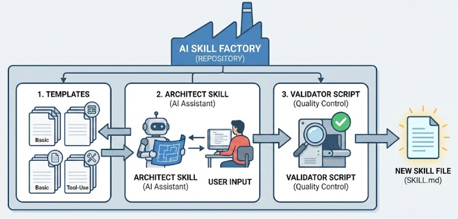

<div align="center">

  <h1>Agent Skills Kit</h1>

  

  <p>
    <b>Write Once, Run Anywhere.</b><br>
    The universal standard for building, validating, and packaging AI Agent Skills.
  </p>

  <p>
    <a href="https://opensource.org/licenses/MIT">
      
    </a>
    <a href="#">
      
    </a>
    <a href="#">
      
    </a>
  </p>
</div>

---
> Toolkit for authoring and packaging Agent Skills. Includes a meta skill, templates, a sample skill, and scripts for validation and packaging.

---
## Anatomy of a Skill

Every skill consists of a required SKILL.md file and optional bundled resources:

```markdown
skill-name/
├── SKILL.md (required)
│   ├── YAML frontmatter (required)
│   │   ├── name: (required)
│   │   └── description: (required)
│   └── Markdown instructions (required)
└── Bundled Resources (optional)
    ├── scripts/          - Executable code (Python/Bash/etc.)
    ├── references/       - Documentation intended to be loaded into context as needed
    └── assets/           - Files used in output (templates, icons, fonts, etc.)
```

---
## Quickstart

1. Update owner metadata in .claude-plugin/marketplace.json.
2. Use skill-creator or run the toolkit scripts to create new skills.
3. Validate and package skills for distribution.

### Toolkit Scripts

Toolkit scripts for creating and packaging skills.

- init_skill.py: scaffold a new skill directory

```bash
python scripts/init_skill.py my-new-skill --path skills
```

- validate_skill.py: validate SKILL.md frontmatter and structure

```bash
python scripts/validate_skill.py skills/my-new-skill
```

- package_skill.py: validate and zip a skill for distribution

```bash
python scripts/package_skill.py skills/my-new-skill
```

The initializer creates example files in scripts/, references/, and assets/ so you can customize or delete them.

---
## IDE Compatibility & Setup

This kit works in Claude Code, VS Code, Cursor, and other IDEs. The skill files are plain Markdown with optional scripts.

This kit is designed to be "write once, run anywhere." Here is how to load these skills into your favorite AI-powered editor.

### VS Code (GitHub Copilot)

Docs: https://code.visualstudio.com/docs/copilot/customization/agent-skills

VS Code looks for skills in `.github/skills` by default, but you can configure it to look in this repo's `skills/` directory.

**Method A: Configuration (Recommended)**
1. Open your workspace settings (`.vscode/settings.json`).
2. Add the `chat.agentSkillsLocations` setting pointing to the skills directory:
    ```json
    {
       "chat.agentSkillsLocations": [
          "./skills": true
       ]
    }
    ```
3. Restart VS Code or reload the window. Copilot will now automatically discover all skills in the folder.

**Method B: Standard Folder**

Create a symbolic link or copy the `skills/` folder to `.github/skills` in your workspace root.

### Cursor

Docs: https://cursor.com/docs/context/skills

Cursor automatically discovers skills in `.cursor/skills` or `.claude/skills`.

**Method A: Symbolic Link (Recommended)**

Run this command in your repository root to link the folder so Cursor can see it:

```bash
# MacOS / Linux
ln -s skills .cursor/skills

# Windows (Command Prompt as Admin)
mklink /D .cursor\skills skills
```

**Method B: Import from GitHub**

1. Open Cursor Settings > General > Rules.
2. Under "Agent Skills," click Add Request.
3. Select Remote Rule (GitHub) and paste this repository's URL.

Usage: Cursor will automatically use the skill when relevant. You can also manually trigger it by typing `/` followed by the skill name (e.g., `/skill-creator`) in the Chat (Cmd+L) or Composer (Cmd+I).

### Google Antigravity

Docs: https://antigravity.google/docs/skills

Antigravity looks for workspace-specific skills in the `.agent/skills` directory.

Setup: You must link or copy the skills to the expected directory structure.

```bash
# MacOS / Linux
mkdir -p .agent
ln -s ../skills .agent/skills

# Windows
mkdir .agent
mklink /D .agent\skills ..\skills
```

Usage: Antigravity automatically detects skills based on their description in SKILL.md. Ensure you are in "Agent Mode" (not just standard chat) for the model to execute scripts included in the skills.

### Claude (CLI & Web)

Docs: https://platform.claude.com/docs/en/agents-and-tools/agent-skills/overview

This repository is configured as a Claude Plugin.

**Method A: Claude Code (CLI)**

If you have the claude CLI installed, you can add this entire repository as a plugin source:

```bash
/plugin marketplace add https://github.com/bcastelino/agent-skills-kit.git
```

This registers the skills defined in `.claude-plugin/marketplace.json`.

**Method B: Manual Install**

Copy the specific skill folder you want (e.g., `skills/skill-creator`) to your project's local config folder:

- Project-level: `.claude/skills/`
- Global: `~/.claude/skills/`

---
## Creating a Skill



Use the skill-creator or start from templates:

- skills/skill-creator/templates/basic.md for instruction-only skills
- skills/skill-creator/templates/advanced.md for skills with scripts

After authoring:

```bash
python scripts/validate_skill.py skills/{skill-name}
python scripts/package_skill.py skills/{skill-name}
```

---
## Compatibility Notes

- Keep descriptions specific; they are the primary trigger for skill activation.
- Include usage triggers in the description ("Use this when ...").
- Place large references in references/ to keep SKILL.md concise.
- Prefer scripts for deterministic tasks.

---
## Validation Rules

The validator enforces Agent Skills best practices and the open spec:

- Name must be kebab-case, 1-64 characters, and match the folder name
- Description must be 1-1024 characters and include trigger keywords (use/when)
- Avoid reserved words in name/description (claude, anthropic)
- No XML/HTML tags in the description
- Frontmatter supports flat key/value pairs with inline lists/maps only; nested YAML and multi-line values are not supported
- Allowed frontmatter keys: name, description, license, compatibility, allowed-tools, metadata
- SKILL.md should be 500 lines or fewer

---
## References

- Agent Skills best practices: [platform.claude.com/docs/en/agents-and-tools/agent-skills/best-practices](https://platform.claude.com/docs/en/agents-and-tools/agent-skills/best-practices)
- Anthropic skills repo: [github.com/anthropics/skills](https://github.com/anthropics/skills)
- Skill creator reference: [github.com/anthropics/skills/tree/main/skills/skill-creator](https://github.com/anthropics/skills/tree/main/skills/skill-creator)
- Awesome Claude Skills: [https://github.com/ComposioHQ/awesome-claude-skills](https://github.com/ComposioHQ/awesome-claude-skills)
- Open spec: [agentskills.io/home](https://agentskills.io/home)

---
## Author

<table>
   <tr>
      <td>
         <div style="flex-shrink: 0; order: 2;">
            
         </div>
      </td>
      <td>
         <div align="left" style="padding: 20px;">
            <div style="display: flex; flex-wrap: wrap; justify-content: center; align-items: center; width: 100%; max-width: 800px; gap: 40px; text-align: center;">
               <div style="flex: 1; min-width: 250px; order: 1;">
                  <h1 style="font-size: 2em; margin-bottom: 5px; color: #333;">Brian Denis Castelino</h1>
                  <p style="font-size: 1.2em; color: #555; margin-bottom: 10px;">Data Analytics Engineer | AI Enthusiast</p>
                  <p style="font-size: 1em; color: #777; margin-bottom: 20px;">I turn vague ideas into clean, working systems, because someone’s got to 🤖</p>
                  <div style="display: flex; justify-content: center; gap: 30px;">
                     <a href="https://github.com/bcastelino" target="_blank" style="text-decoration: none;">
                     
                     </a>
                   &nbsp; &nbsp; &nbsp;
                     <a href="https://linkedin.com/in/cas7elino" target="_blank" style="text-decoration: none;">
                     
                     </a>
                   &nbsp; &nbsp; &nbsp;
                     <a href="https://twitter.com/cas7elino" target="_blank" style="text-decoration: none;">
                     
                     </a>
                   &nbsp; &nbsp; &nbsp;
                     <a href="https://instagram.com/cas7elino" target="_blank" style="text-decoration: none;">
                     
                     </a>
                   &nbsp; &nbsp; &nbsp;
                     <a href="https://brianc.framer.website/" target="_blank" style="text-decoration: none;">
                     
                     </a>
                  </div>
               </div>
      </td>
      </div>
      </div>
   </tr>
</table>
